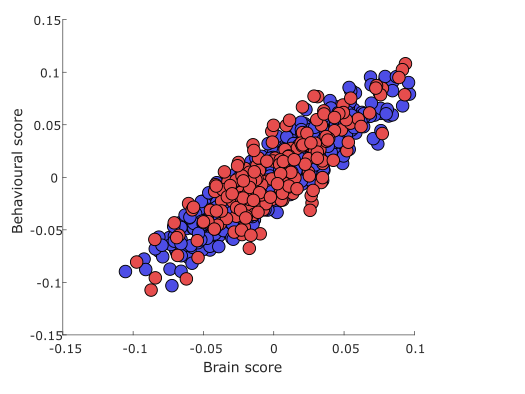
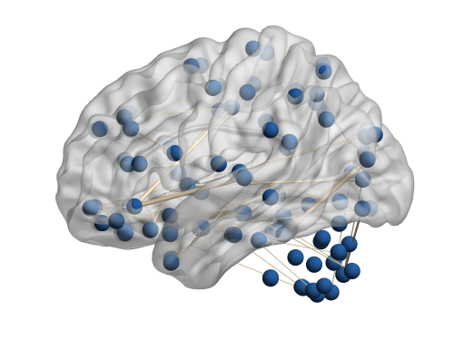
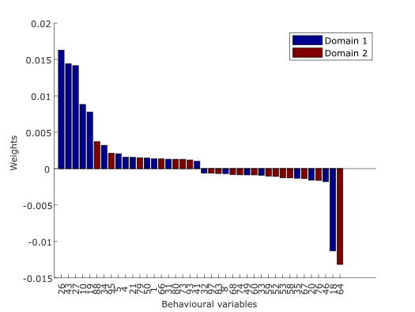

<span style="font-size:2em;">__demo_fmri__</span>

This is a demo for functional MRI data. We will discuss step by step how to 
set up and run an analysis as well as how to visualize the results. Copy
and paste the code chunks into a function to create your own experiment.

###  Analysis
First, run `set_path` to add the necessary paths of the toolkit 
to your MATLAB path.

```matlab
%----- Analysis

% Set path for analysis
set_path;
```

####  Project Folder
Next, we specify the folder to our project. Since we will use the toolkit
to generate fake functional MRI data, we do not need to provide input data (`X.mat`
and `Y.mat`). Make sure to specify the correct path. We recommend to use a 
full path, but a relative path should also work.

```matlab
% Project folder
cfg.dir.project = fullfile('projects', 'demo_fMRI');
```

####  Machine
Now, we configure the CCA/PLS model we would like to use. We set 
`machine.name` to `cca` and `machine.param.name` to `{'PCAx' 'PCAy'}` for 
[PCA-CCA](../../background/#cca-with-pca-dimensionality-reduction-pca-cca).
For quicker results, we fix the number of principal components. However, in 
general we recommend to determine the optimal number of components based 
on a grid search similar to [demo_smri](../demo_smri).

```matlab
% Machine settings
cfg.machine.name = 'cca';
cfg.machine.param.name = {'PCAx' 'PCAy'};
cfg.machine.param.PCAx = 95;
cfg.machine.param.PCAy = 95;
```

For more information on the CCA/PLS models and the hyperparameter choices,
see [here](../../cfg/#machine).

####  Data
As we use the toolkit to generate fake functional MRI data for us, we need 
to define the number of subjects/examples, and the number of features/variables in
our `X` and `Y` data.

```matlab
% Fake fMRI connectivity data dimensionality
cfg.data.nsubj = 1000;
cfg.data.X.nfeat = 100;
cfg.data.Y.nfeat = 100;
```

For further details on the choices of data settings, see [here](../../cfg/#data).

####  Framework
Next, we set the framework name to `holdout` and the number of outer data 
splits to 5 to perform a multiple holdout approach. The `frwork.flag` field 
defines a custom name for this analysis. Make sure to give it a name that 
will help you organize different analyses you might run on your data.

```matlab
% Framework settings
cfg.frwork.name = 'holdout';
cfg.frwork.split.nout = 5;
cfg.frwork.flag = '_test';
```

For further details on the framework choices, see [here](../../cfg/#frwork).

####  Deflation
Next, we set the deflation of PCA-CCA. We will use generalized deflation.
As we use a multiple holdout approach, we have additional options. We
set `defl.crit = 'correl'` to define the best data split based on maximum 
out-of-sample correlation. As we set `defl.split = 'all'`, the best data 
split will be deflated from all other data splits. This approach is similar 
to one used in [Monteiro et al. (2016) J. Neurosci. Methods 271, 182-194.](https://doi.org/10.1016/j.jneumeth.2016.06.011)

```matlab
% Deflation settings
cfg.defl.name = 'generalized';
cfg.defl.crit = 'correl';
cfg.defl.split = 'all';
```

For further details on the deflation choices, see [here](../../cfg/#defl).

####  Environment
Next, we set the computational environment for the toolkit. As our
PCA-CCA implementation is computationally efficient, most of the times we can run
it locally on our computer.

```matlab
% Environment settings
cfg.env.comp = 'local';
```

For further details on the environmental settings, see [here](../../cfg/#env).

####  Statistical Inference
Finally, we need to define how the significance testing is performed. 
As we use a multiple holdout approach, we have additional options here too.
We will perform statistical inference in two steps. First, for each outer split 
we do permutation testing based on out-of-sample correlation. Second, to 
infer if the associative effect is significant across splits, __omnibus hypothesis__ 
is used, which tests if any outer split is significant after adjusting the 
threshold with Bonferroni correction (e.g., p=0.01 in case of 5 splits). This
approach is set by `stat.split.crit = 'correl'` and `stat.overall.crit =
'no'` and it is taken from [Monteiro et al. (2016) J. Neurosci. Methods 271, 182-194.](https://doi.org/10.1016/j.jneumeth.2016.06.011)
For quicker results, we wet the number of permutations to 100, however, 
we recommend using at least 1000 permutations in general. 

```matlab
% Number of permutations
cfg.stat.nperm = 100;
cfg.stat.split.crit = 'correl';
cfg.stat.overall.crit = 'no';
```

For further details on the statistical inference, see [here](../../cfg/#stat).

####  Run Analysis
To run the analysis, we simply update our `cfg` structure to add all 
necessary default values that we did not explicitly define and then run 
the `main` function. After the analysis, we clean up all the duplicate
and intermediate files to save disc space.

```matlab
% Update cfg with defaults
cfg = cfg_defaults(cfg);

% Run analysis
main(cfg);

% Clean up analysis files to save disc space
cleanup_files(cfg);
```

##  Visualization
Now that we have run our first analysis, let's plot some of the results. 
Before we can do any plotting, we need to make sure that we have called 
`set_path('plot')` to add the plotting folder. Then we load the `res`
structure.

In general, we advise you to plot your results on a local computer as it 
is often cumbersome and slow in a cluster environment. If you move your 
results from a cluster to a local computer, you need update the paths in 
your `cfg*.mat` and `res*.mat` files using `update_dir`. This should be 
called once the `res` structure is loaded either manually or by `res_defaults`.

```matlab
%----- Visualization

% Set path for plotting and the BrainNet Viewer toolbox
set_path('plot', 'brainnet');

% Load res
res.dir.frwork = cfg.dir.frwork;
res.env.fileend = cfg.env.fileend;
res.frwork.level = 1;
res = res_defaults(res, 'load');
```

### Create Labels
As we used fake functional MRI and behavioural data, we need to create 
labels. Although we recommend to use a multi-modal or functional atlas
for fMRI connectivity data, for simplicity, we will use the AAL atlas to
create a subset of 100 connections of the full connectivity matrix between 
all AAL regions. For our behavioural features, we will simply use indexes 
as label and 2 domains as category variable.

```matlab
% Create AAL labels for full fake connectivity data
BrainNet_GenCoord(which('AAL2.nii'), 'AAL2.txt');
T = readtable('AAL2.txt');
T.Properties.VariableNames([1:3 6]) = {'X' 'Y' 'Z' 'Index'}; % we will need only these variables
T.Label = sprintfc('Region-%d', [1:120]'); % we need characters for this label
writetable(T(:,[1:3 6:7]), fullfile(cfg.dir.project, 'data', 'LabelsX.xlsx'));
delete AAL2.txt; % clean up

% Create mask for subset of 100 connections used as features in input data
mask = false(120);
full_mask_id = find(tril(true(120), -1));
rand_id = randperm(numel(full_mask_id));
rand_id(1:100)
mask(rand_id(1:100)) = 1;
save(fullfile(cfg.dir.project, 'data', 'mask.mat'), 'mask');

% Create labels for fake behavioural data
T = table([1:100]', [repmat({'Domain 1'}, 50, 1); repmat({'Domain 2'}, 50, 1)], 'VariableNames', {'Label' 'Category'});
writetable(T, fullfile(cfg.dir.project, 'data', 'LabelsY.xlsx'));
```

###  Plot Data Projections
To plot the data projections (or latent variables) that has been 
learnt by the model, simply run `plot_proj`. As first argument, we need 
to pass the `res` structure. Then, we specify the data modalities as cell 
array and the level of associative effect. In this example, we plot the 
projections of `X` and `Y` for the first associative effect.
We set the fourth input parameter to 'osplit' so that the training and 
test data of the outer split will be used for the plot. The following 
argument defines the outer data split we want to use (in this demo, we 
have only one split). We use the second to last argument to specify the 
colour-coding of the data using the training and test data as groups 
(`teid`). Finally, we specify the low-level function that will plot the 
results. In this case it is `plot_proj_2d_group`. Please see the 
documentation of [plot_proj](../mfiles/plot_proj/) for more details. 

```matlab
% Plot data projections
plot_proj(res, {'X' 'Y'}, res.frwork.level, 'osplit', res.frwork.split.best, 'teid', '2d_group')
```



###  Plot Weights
Plotting model weights heavily depends on the kind of data that has been 
used in the analysis. In case of our fake functional MRI connectivity data, 
we will plot the weights as edges on a glass brain. We will use only the top 20 
most positive and top 20 most negative weights for the figure. We set 
this by first sorting the weights by their sign (`roi.weight.sorttype = sign`)
then taking the top 20 from both ends (`roi.weight.numtop = 20`). In case 
of our fake behavioural data, we will plot the weights as a vertical bar 
plot, again using only the top 20 most positive and top 20 most negative
weights. As first argument, we need to pass the `res` function, in which
we define our custom processing for the weights. Next, we specify the 
data modality and the type of the modality as strings. In this example, we use 
brain connectivity and behavioural data, so we set these to `X` and `conn`
for one and `Y` and `behav` for the other. The following argument 
defines the outer data split we want to use. Finally, we specify 
the low-level function that will plot the results. In this example, it 
will be `plot_weight_brain_edge` and `plot_weight_behav_vert`. Please 
see the documentation of [plot_weight](../mfiles/plot_weight) for more details. 

```matlab
% Plot connectivity weights on glass brain
res.conn.weight.sorttype = 'sign';
res.conn.weight.numtop = 20;
plot_weight(res, 'X', 'conn', res.frwork.split.best, 'brain_edge');
```



```matlab
% Plot behavioural weights as vertical bar plot
res.behav.weight.sorttype = 'sign';
res.behav.weight.numtop = 20;
plot_weight(res, 'Y', 'behav', res.frwork.split.best, 'behav_vert');
```



