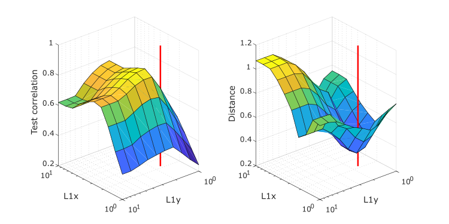
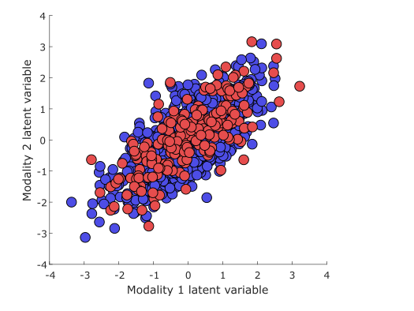
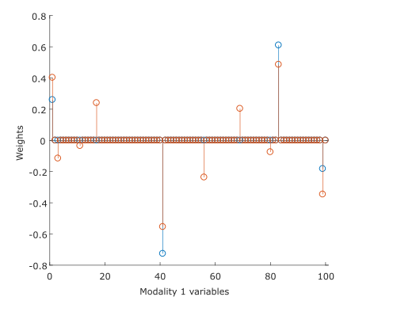
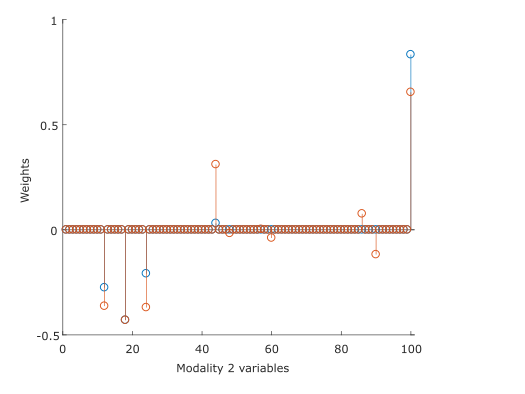

<span style="font-size:2em;">__demo_simulation__</span>

This is a demo for simulated data. We will discuss step by step how to 
set up and run an analysis as well as how to visualize the results. Copy
and paste the code chunks into a function to create your own experiment.

###  Analysis
First, run `set_path` to add the necessary paths of the toolkit 
to your MATLAB path.

```matlab
%----- Analysis

% Set path for analysis
set_path;
```

####  Project Folder
Next, we specify the folder to our project. Since we will use the toolkit
to generate simulated data, we do not need to provide input data (`X.mat`
and `Y.mat`). Make sure to specify the correct path. We recommend to use a 
full path, but a relative path should also work.

```matlab
% Project folder
cfg.dir.project = fullfile('projects', 'demo_simulation');
```

####  Machine
Now, we configure the CCA/PLS model we would like to use. We set 
`machine.name` to `spls` for [Sparse PLS](../../background/#sparse-pls-spls).
To select the best hyperparameter (L1 regularization for SPLS), we will use 
generalizability (measured as average out-of-sample corretion on the 
validation sets) and stability (measured as the avarage similarity of 
weights across the inner training sets) as a joint optimization criterion. 
This is set by `machine.param.crit = correl+simwxy`. For further details 
on this criterion, see [Mihalik et al. (2020)](https://doi.org/10.1016/j.biopsych.2019.12.001)

```matlab
% Machine settings
cfg.machine.name = 'spls';
cfg.machine.param.crit = 'correl+simwxy';
```

For more information on the CCA/PLS models and the hyperparameter choices,
see [here](../../cfg/#machine).

####  Data
As we use the toolkit to simulate data for us, we need to define the 
the number of subjects/examples, and the number of features/variables in
our `X` and `Y` data.

```matlab
% Simulated data dimensionality
cfg.data.nsubj = 1000;
cfg.data.X.nfeat = 100;
cfg.data.Y.nfeat = 100;
```

For further details on the choices of data settings, see [here](../../cfg/#data).

####  Framework
Next, we set the framework name to `holdout` and the number of outer data 
splits to 1 to perform a single holdout approach. The `frwork.flag` field 
defines a custom name for this analysis. Make sure to give it a name that 
will help you organize different analyses you might run on your data.

```matlab
% Framework settings
cfg.frwork.name = 'holdout';
cfg.frwork.split.nout = 1;
cfg.frwork.flag = '_test';
```

For further details on the framework choices, see [here](../../cfg/#frwork).

####  Deflation
Next, we set the deflation of SPLS. We will use PLS-mode A deflation.

```matlab
% Deflation settings
cfg.defl.name = 'pls-modeA';
```

For further details on the deflation choices, see [here](../../cfg/#defl).

####  Environment
Next, we set the computational environment for the toolkit. As our data is
relatively low-dimensional (i.e., number of features is not too high)
SPLS we do run quiclky locally on our computer.

```matlab
% Environment settings
cfg.env.comp = 'local';
```

For further details on the environmental settings, see [here](../../cfg/#env).

####  Statistical Inference
Finally, we need to define how the significance testing is performed. 
For quicker results, we wet the number of permutations to 100, however, 
we recommend using at least 1000 permutations in general. 

```matlab
% Number of permutations
cfg.stat.nperm = 100;
```

For further details on the statistical inference, see [here](../../cfg/#stat).

####  Run Analysis
To run the analysis, we simply update our `cfg` structure to add all 
necessary default values that we did not explicitly define and then run 
the `main` function. After the analysis, we clean up all the duplicate
and intermediate files to save disc space.

```matlab
% Update cfg with defaults
cfg = cfg_defaults(cfg);

% Run analysis
main(cfg);

% Clean up analysis files to save disc space
cleanup_files(cfg);
```

##  Visualization
Now that we have run our first analysis, let's plot some of the results. 
Before we can do any plotting, we need to make sure that we have called 
`set_path('plot')` to add the plotting folder. Then we load the `res`
structure.

In general, we advise you to plot your results on a local computer as it 
is often cumbersome and slow in a cluster environment. If you move your 
results from a cluster to a local computer, you need update the paths in 
your `cfg*.mat` and `res*.mat` files using `update_dir`. This should be 
called once the `res` structure is loaded either manually or by `res_defaults`.

```matlab
%----- Visualization

% Set path for plotting
set_path('plot');

% Load res
res.dir.frwork = cfg.dir.frwork;
res.env.fileend = cfg.env.fileend;
res.frwork.level = 1;
res = res_defaults(res, 'load');
```

###  Plot Grid Search Results
First, we plot the grid search results of the hyperparameter
optimization. As first argument, we need to pass the `res` structure. 
Then we specify the data modality as string. The last argument is a 
varargin to define an optional number of metrics. Each metric will be 
plotted as a function of the hyperparameter grid and in a separate
subplot. In this example, we plot the test (out-of-sample) correlation 
and the joint generalizability-stability criterion (`dist2`), which was 
used for selecting the best hyperparameter. For more details, see
[Mihalik et al. (2020)](https://doi.org/10.1016/j.biopsych.2019.12.001)

```matlab
% Plot hyperparameter surface for grid search results
plot_paropt(res, {'X' 'Y'}, 1, 'correl', 'dist2');
```



###  Plot Data Projections
To plot the data projections (or latent variables) that has been 
learnt by the model, simply run `plot_proj`. As first argument, we need 
to pass the `res` structure, in which we define a custom `xlabel` and 
`ylabel`. Then, we specify the data modalities as cell array and the level 
of associative effect. In this example, we plot the projections of `X` and 
`Y` for the first associative effect. We set the fourth input parameter to 
'osplit' so that the training and test data of the outer split will be used 
for the plot. The following argument defines the outer data split we want 
to use (in this demo, we have only one split). We use the second to last 
argument to specify the colour-coding of the data using the training and 
test data as groups (`teid`). Finally, we specify the low-level 
function that will plot the results. In this case it is `plot_proj_2d_group`.
Please see the documentation of [plot_proj](../mfiles/plot_proj/) for more details.

```matlab
% Plot data projections
res.proj.xlabel = 'Modality 1 latent variable';
res.proj.ylabel = 'Modality 2 latent variable';
plot_proj(res, {'X' 'Y'}, res.frwork.level, 'osplit', 1, 'teid', '2d_group')
```



###  Plot Weights
Plotting model weights heavily depends on the kind of data that has been 
used in the analysis. In case of our simulated data, we are interested
if the model can recover the weights that were used for generating the
data (these true model weights were automatically saved in our `data` 
folder as `wx.mat` and `wy.mat`). We we use a stem plot with the recovered 
weights in blue, and the true weights in red. Again, we use a costum
`xlabel` in the figures. As first argument, we need to pass the `res` 
function, in which we define our custom `xlabel` for the figures. Next, 
we specify the data modality and the type of the modality as strings. In 
this example, we set these to `X` or `Y` and `simul`. The following 
argument defines the outer data split we want to use. Finally, we specify 
the low-level function that will plot the results. In this example, it 
will be `plot_weight_stem`. Please see the documentation of 
[plot_weight](../mfiles/plot_weight) for more details. 
```matlab
% Plot X weights as stem plot
res.simul.xlabel = 'Modality 1 variables';
plot_weight(res, 'X', 'simul', 1, 'stem');
```



```matlab
% Plot Y weights as stem plot
res.simul.xlabel = 'Modality 2 variables';
plot_weight(res, 'Y', 'simul', 1, 'stem');
```



