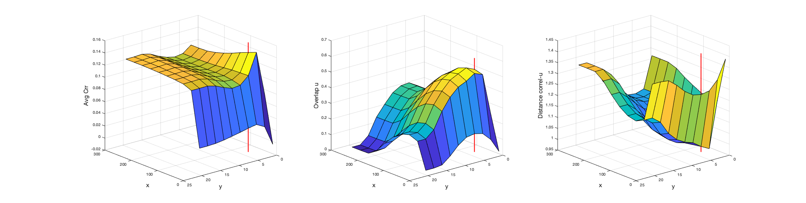

__plot_paropt__

It plots the grid search results of the hyperparameter optimization. 

##  Syntax
      plot_paropt(res, mod, split, varargin)
    
##  Inputs
*   **res** [*struct*]
    
    res structure containing information about results and plot specifications
    
*   **mod** [*cell array*]
    
    modality of data to be used for plotting (i.e., {'X', 'Y'})
    
*   **split** [*int*]
    
    index of data split to be used
    
*   **varargin** [*'correl', 'covar', 'simwx', 'simwy', 'simwxy', 'correl+simwxy'*]
    
    metrics to be plotted as a function of hyperparameter grid, each metric 
    in a separate subplot
    
##  Examples
       % Plot hyperparameter surface for grid search results
       plot_paropt(res, {'X' 'Y'}, res.frwork.split.best, 'correl', 'simwxy', ...
                   'correl+simwxy');
    

---
See also: [plot_proj](../plot_proj), [plot_weight](../plot_weight)

