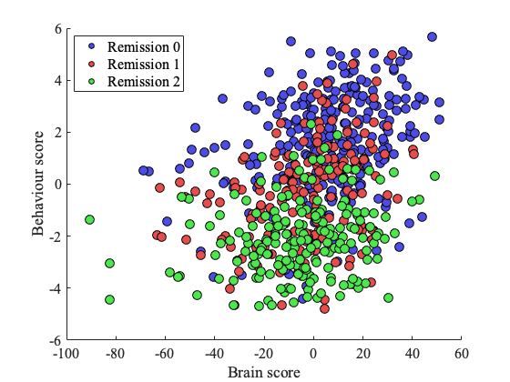

__plot_proj__

It plots the projections of the data (or latent variables).

##  Syntax
      plot_proj(res, mod, level, sidvar, split, label, func, varargin)
    
##  Inputs
*   **res** [*struct*]
    
    res structure containing information about results and plot specifications
    
*   **mod** [*cell array*]
    
    modality of data to be used for plotting (i.e., {'X', 'Y'}) 
    
*   **level** [*int or numeric array*]
    
    level of associative effect with same dimensionality as 'mod' or 
    automatically extended (e.g. from int to numeric array)
    
*   **sidvar** [*'osplit', 'otrid', 'oteid', 'isplit', 'itrid',  'iteid'*]
    
    specifies subjects to be used for plotting
    
    first letter can be 'o' for outer or 'i' for inner split, followed by 
    either 'trid' for training, 'teid' for test or 'split' for both 
    training and test data
    
*   **split** [*int or numeric array*]
    
    index of data split to be used with same dimensionality as 'mod' or 
    automatically extended (e.g. from int to numeric array)
    
*   **label** [*'none', char*]
    
    'none' for scatterplot with same colour for all subjects or
    
    label (e.g. from LabelsY.xlsx) to be used as a continuous colormap
    (e.g. Age) or for colouring different groups (e.g. Male); label file
    and corresponding data file are specified by 'res.proj.file.label' and 
    'res.proj.file.data'
    
    if '+' is included in the character (e.g. 'MDD+HC') group information is 
    taken from cfg.data.group
    
*   **func** [*'2d', '2d_group', '2d_cmap'*]
    
    name of the specific plotting function (after plot_proj_* prefix) to
    be called
    
*   **varargin** [*name-value pairs*]
    
    additional options can be passed via name-value pairs with dot notation
    supported (e.g., 'proj.xlim', [-5 5])
    
##  Examples
###  Simple Plots
Most often, we plot brain score vs. behaviour score for a specific 
level (i.e., associative effect).

       % Plot data projections coloured by groups provided in data/label files
       res.proj.file.data = fullfile(res.dir.project, 'data', 'V.mat');
       res.proj.file.label = fullfile(res.dir.project, 'data', 'LabelsV.xlsx');
       plot_proj(res, {'X' 'Y'}, res.frwork.level, 'osplit', res.frwork.split.best, ...
                 'Remission', '2d_group');   
    

###  Multi Level Plots
To plot projections aggregated over multiple levels, all you need to 
specify is res.proj.multi_level = 1 and provide a 2D cell array of input 
variable 'mod'. Input variables 'level' and 'split' should have the same 
dimensionality or they will be extended automatically from 1-D or 2-D arrays
(e.g. level = repmat(level, size(mod))).

       % Plot data projections across levels (and averaged over modalities 
       % in a given level after standardization)
       res.proj.multi_label = 1;
       plot_proj(res, {'X' 'Y'; 'X' 'Y'}, [1 1; 2 2], 'osplit', res.frwork.split.best, ...
                 'Remission', '2d_group');
    
---
See also: [plot_paropt](../plot_paropt), [plot_weight](../plot_weight/)

